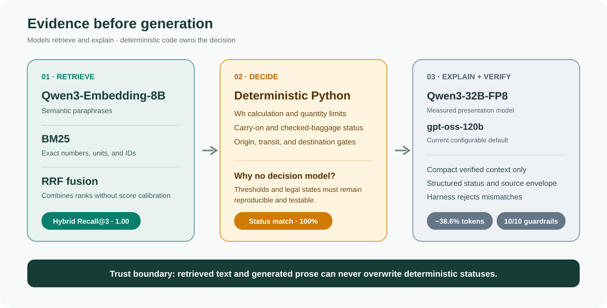
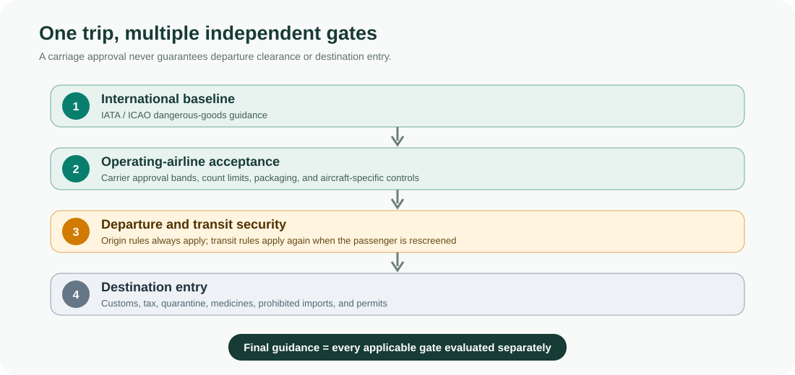

# CarryCheck

CarryCheck is a verified airline-baggage RAG agent that separates evidence retrieval, deterministic policy decisions, and generative explanations. It was built with FuriosaAI during Soongsil University's **GPU/NPU-Based RAG and LLM Agent Practice** short course ([course details](docs/PRESENTATION_REPORT.md#course)).

## Project Overview

Enter an airline, route, countries, and a natural-language item description. CarryCheck returns carry-on, checked-baggage, and destination-entry results with required conditions and official sources in one screen.

## Performance

Presentation snapshot: 10 curated questions; not a production benchmark.


- **Retrieval coverage ·** Hybrid Recall@3 **1.00** — relevant evidence appeared within the top three results for all 10 questions.
- **Verified decisions ·** **100%** transport-status match and **10/10** guardrails passed — generation preserved deterministic statuses and known source IDs.
- **Context efficiency ·** **4,396 → 2,699** tokens (**−38.6%**) — selective evidence removed 1,697 tokens from one identical request.

See [Evaluation](docs/EVALUATION.md) for complete measurements, experiment details, and limitations.

## System at a Glance



1. **Retrieve:** Qwen3 embeddings and BM25 find semantic and exact regulatory evidence, then RRF combines their rankings.
2. **Decide:** Deterministic airline and country engines own every numerical calculation and status.
3. **Explain:** The LLM receives only compact verified context, and the Harness rejects status or source-ID mismatches.

See [Architecture](docs/ARCHITECTURE.md) for the detailed system diagram, component decisions, safety invariants, and implementation details.

## Service Flow



1. Enter the airline, route, countries, and item description.
2. Parse measurements and retrieve the most relevant official evidence.
3. Calculate airline and country policy gates with deterministic code.
4. Generate and validate the explanation, then display decisions and sources.

Current coverage includes Korean Air, Asiana Airlines, Jeju Air, shared IATA guidance, and selected China, Thailand, and Japan rules. Airline carriage, departure security, transit notices, destination customs, and quarantine remain separate checks; see [Regulatory Sources](docs/REGULATORY_SOURCES.md) for effective dates, dependencies, and coverage limitations.

## Run with Furiosa APIs

```bash
cp -n .env.example .env
# Add the two FURIOSA API keys to .env
./scripts/run_api.sh
```

Open <http://127.0.0.1:8000>.

The Furiosa embedding and Chat integrations use OpenAI API-compatible request and response formats.

## License

CarryCheck's original source code, interface, documentation, dataset structure, and
repository-authored summaries are available under the [MIT License](LICENSE).

The airline, IATA, regulator, customs, and quarantine materials cited by the project remain
subject to their respective owners' rights and terms. Source citations identify provenance;
they do not relicense the underlying publications. See [Third-Party Source Notice](THIRD_PARTY_NOTICES.md)
and [Regulatory Sources](docs/REGULATORY_SOURCES.md) for details.
