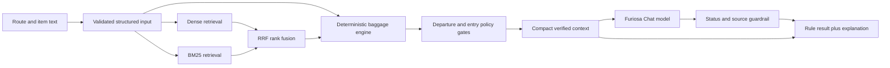
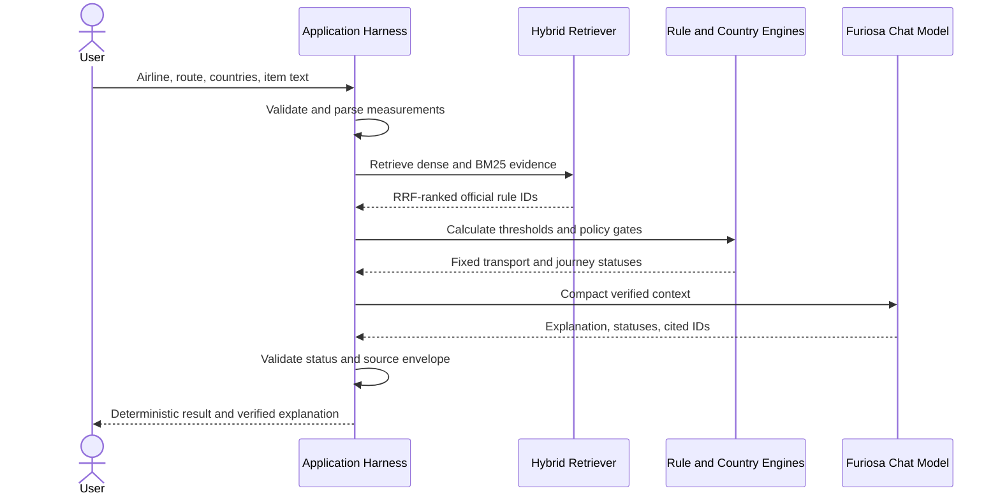

# CarryCheck

CarryCheck is a verified airline-baggage RAG agent that separates evidence retrieval, deterministic policy decisions, and generative explanations.

## Course

- **Program:** Furiosa AI GPU/NPU-based LLM Agent and RAG Practice
- **Organizer:** Next-Generation Semiconductor Innovative Convergence University Project Group, Soongsil University
- **Dates:** July 30–31 and August 7, 2026
- **Topics:** LLM agents · RAG · tool use · guardrails · retrieval evaluation · inference efficiency
- **Team deliverable:** Airline baggage and destination-entry policy agent

See the [Project Report](docs/PRESENTATION_REPORT.md) for the course context, presentation design, lessons, and roadmap.

## Project Overview

CarryCheck evaluates airline acceptance, departure security, transit notices, and destination customs or quarantine as separate policy gates. It extracts measurements such as `mL`, `mAh`, `V`, `Wh`, weight, and quantity, retrieves the relevant official rules, and lets deterministic Python code decide the status. The Chat model receives only the verified result and supporting rule IDs, so it can explain but cannot change the decision.

Supported scope: Korean Air, Asiana Airlines, Jeju Air, shared IATA guidance, and selected China, Thailand, and Japan policies. See [Regulatory Sources](docs/REGULATORY_SOURCES.md) for effective dates, rule dependencies, and coverage gaps, and [Security Policy](SECURITY.md) for responsible deployment guidance.

## Performance

Presentation snapshot: 10 curated questions; not a production benchmark.


| RAG outcome | Result | Why it matters |
| --- | ---: | --- |
| Retrieval coverage | Hybrid Recall@3 **1.00** | Relevant evidence appeared within the top three results for all 10 questions |
| Verified decisions | **100%** transport-status match; **10/10** guardrails passed | Generation preserved deterministic statuses and known source IDs |
| Context efficiency | **4,396 → 2,699** tokens (**−38.6%**) | Selective evidence reduced one identical request by 1,697 tokens |

See [Evaluation](docs/EVALUATION.md) for charts, exact scope, experiment details, and limitations.

## Architecture and Technical Rationale



| Component | Why it exists | Technical responsibility | Observed effect |
| --- | --- | --- | --- |
| Input validation and parser | Policy thresholds cannot be applied safely to ambiguous or invalid values | Reject unknown overrides and non-finite values; extract item type, route, capacity, voltage, quantity, and exception flags | Missing safety-critical values return `needs_information` instead of optimistic permission |
| Dense retrieval | Equivalent items can be described with different vocabulary | Furiosa Qwen3 embeddings in API mode; character TF-IDF in local mode | Recall@3 1.00 and MRR 0.80 on the 10-question presentation set |
| BM25 retrieval | Regulations depend heavily on exact numbers, units, and IDs | Lexical ranking for terms such as `100Wh`, `160Wh`, `100mL`, and rule codes | MRR 0.95 on the presentation set |
| RRF fusion | Dense and BM25 scores are not directly comparable | Merge both ranked lists without score calibration | Hybrid Recall@3 1.00 and MRR 0.933; no improvement over BM25 was demonstrated on the small set |
| Deterministic baggage engine | An LLM can misstate numerical limits or conditional approvals | Calculate `Wh`, apply airline thresholds, and determine carry-on and checked-baggage statuses | Carry-on and checked-baggage decisions matched all 10 expected cases |
| Country policy gates | Aircraft carriage and legal entry are different decisions | Apply origin security, destination customs/quarantine, and transit notices independently | Prevents a customs declaration from being mislabeled as an aviation prohibition |
| Verified answer agent | Generative text is useful only after the decision is fixed | Send compact context, require matching statuses, and allow only retrieved rule IDs | 10/10 guardrail cases passed; invalid model output is rejected |
| Compact context | Sending every regulation wastes tokens and increases irrelevant context | Limit the model input to the verified decision and selected evidence | 4,396 → 2,699 tokens, a 38.6% reduction |
| Shared HTTP assembly | Separate local and serverless logic can drift | Reuse the same validation and response builder for local HTTP and Vercel | Identical response contract across deployment adapters |

The design prioritizes decision integrity over unrestricted agent autonomy. Retrieval may rank evidence and the LLM may phrase an answer, but only the rule engine and country evaluators can produce authoritative statuses. The API profile also avoids silent local fallback, making the model path and failures observable during evaluation.

See [Architecture](docs/ARCHITECTURE.md) for component decisions, safety invariants, and the mapping between the presentation and current implementation.

## Service Flow



## Run with Furiosa APIs

```bash
cp -n .env.example .env
# Add the two FURIOSA API keys to .env
./scripts/run_api.sh
```

Open <http://127.0.0.1:8000>.

The Furiosa embedding and Chat integrations use OpenAI API-compatible request and response formats.
