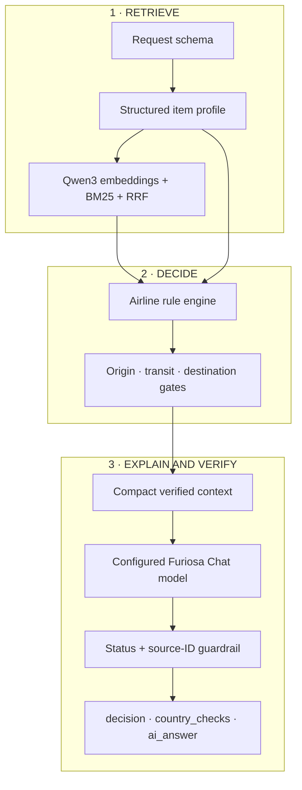

# CarryCheck Architecture

CarryCheck is optimized around one trust boundary: models may retrieve evidence and explain a result, but only deterministic code may set a baggage or journey status. The concise system summary is shown in the [main README](../README.md#system-at-a-glance); this document focuses on detailed design decisions and execution flow.

## How the Design Improves Performance

### 1. Retrieve — improve recall without losing exact matches

Semantic and lexical retrieval run in parallel. Dense embeddings find paraphrases, BM25 preserves exact numbers and rule identifiers, and Reciprocal Rank Fusion combines their rank positions without calibrating incompatible scores.

> **Measured outcome:** Hybrid Recall@3 was `1.00` on the 10-question presentation set. BM25 MRR was `0.95`, higher than Hybrid `0.933`, so fusion is retained for complementary behavior rather than a demonstrated MRR gain.

### 2. Decide — remove numerical decisions from generation

The rule engine calculates `Wh = mAh × V ÷ 1000`, capacity bands, quantities, packaging conditions, and carry-on or checked-baggage status. Country evaluators then apply departure, transit, customs, quarantine, and import gates without merging those legal meanings.

> **Measured outcome:** Carry-on and checked-baggage statuses matched all 10 expected presentation cases.

### 3. Explain and Verify — generate from compact context

Only the fixed decision, conditions, missing information, and selected official evidence reach the Chat model. The returned envelope must repeat the verified statuses and cite only supplied rule IDs.

> **Measured outcome:** Context fell from `4,396` to `2,699` tokens for one identical request, saving `1,697` tokens or `38.6%`; all `10/10` presentation guardrail cases passed.

## Three-Layer Design

### 1. Retrieve

This layer converts a structured item query into a small, source-addressable evidence set. It combines a semantic model with an exact lexical path so neither paraphrases nor regulatory numbers depend on one retrieval method.

#### `furiosa-ai/Qwen3-Embedding-8B` — semantic retrieval

- **Used in:** the August 2026 presentation and the current API retrieval profile.
- **Why:** item descriptions vary even when their meaning is equivalent, such as “power bank” and “portable charger.” An embedding model supplies that semantic path while BM25 protects exact regulatory strings.
- **Measured contribution:** Dense retrieval reached Recall@3 `1.00` and MRR `0.80` on the presentation set.
- **Boundary:** embeddings rank evidence; they cannot set a status or create a rule.

#### BM25 + RRF — exact retrieval and fusion

- **Used in:** every runtime profile; these are retrieval algorithms, not generative models.
- **Why:** values such as `100Wh`, `160Wh`, `100mL`, `CCC`, and source IDs carry exact meaning. BM25 ranks those strings strongly, while RRF merges its result with Dense retrieval using rank positions.
- **Measured contribution:** BM25 MRR was `0.95`; Hybrid Recall@3 remained `1.00` and MRR was `0.933`.
- **Boundary:** the small set did not prove that Hybrid ranking beats BM25. A larger versioned evaluation set is required.

### 2. Decide

This layer owns every authoritative status. It consumes the parsed measurements and retrieved evidence, evaluates airline rules first, and then preserves origin, transit, and destination policies as independent gates.

#### Deterministic Python — authoritative decision engine

- **Used in:** airline, origin, transit, and destination evaluation.
- **Why:** arithmetic, inclusive boundaries, approval bands, and legal states must be reproducible and regression-testable. A language model is intentionally not used for these decisions.
- **Measured contribution:** `100%` carry-on and checked-status match on the 10 presentation cases.
- **Boundary:** unknown items or missing safety-critical values return `needs_information` instead of an inferred permission.

### 3. Explain and Verify

This layer turns the fixed decision into user-facing guidance. The generator receives compact evidence, while the Harness independently checks the returned status envelope and source IDs before accepting the explanation.

#### `furiosa-ai/Qwen3-32B-FP8` — measured presentation generator

- **Used in:** the presented Agent Loop, web screenshot, and token comparison.
- **Why:** the course environment used this Furiosa-hosted generative model for tool-oriented, structured explanations. Its job was narrowed to explaining retrieved evidence and fixed statuses, rather than recalling regulations or calculating limits.
- **Measured contribution:** the Agent Loop completed one `search_rules` call and two iterations with verified output; selective context produced the reported `38.6%` token reduction.
- **Boundary:** the reduction comes from orchestration and context selection, not a benchmark proving that this model alone is more efficient.

#### `furiosa-ai/gpt-oss-120b` — current configurable Chat default

- **Used in:** the current `.env.example` Chat configuration through an OpenAI API-compatible endpoint.
- **Why:** it occupies the same constrained explanation role behind the shared Chat client and structured guardrail. The model can be replaced without changing the deterministic decision boundary.
- **Measured contribution:** none of the presentation numbers are attributed to this later default.
- **Boundary:** strict API mode exposes Chat failure as `ai_answer.status=error`; it does not label a template as verified model output.

## Local Profile — No External Model Calls

The local profile replaces API embeddings with character TF-IDF and does not construct external Chat clients. It exists for deterministic functional verification, not as a performance-equivalent substitute for the API profile.

## Component Chain

### Input boundary

The HTTP layer rejects unknown overrides, invalid choices, non-finite values, and unrealistic numeric inputs. The parser preserves missing values explicitly and extracts route, item type, `mL`, `mAh`, `V`, `Wh`, weight, quantity, battery condition, and packaging.

### Decision boundary

Retrieved chunks support the decision but cannot directly set it. Airline carriage and destination entry remain separate response fields so a customs declaration cannot become an aviation prohibition.

### Generation boundary

Retrieved text is treated as untrusted data, not instructions. Plain text, malformed JSON, empty output, unknown citations, and status mismatches are rejected.

### Runtime boundary

Local HTTP and the Vercel adapter share request validation and `build_response_payload`, preventing duplicated decision paths. `/api/health` exposes the active retrieval and Chat modes, while the strict API profile requires both Furiosa credentials and never silently switches to local retrieval.

## Safety Invariants

1. Only deterministic code sets transport or journey statuses.
2. Missing critical measurements cannot become `allowed` by inference.
3. Air carriage and destination entry remain separate.
4. Every applied or cited rule ID resolves to a committed official source.
5. Duplicate JSON keys, duplicate rule IDs, invalid dates, and non-HTTPS sources fail during dataset loading.
6. Local HTTP and Vercel use one response assembly path.
7. Chat failures never alter or remove the deterministic result.

## Presentation and Current Runtime

**August 2026 presentation**

- Qwen3-Embedding-8B retrieval
- Qwen3-32B-FP8 explanation
- Model-selected `search_rules` call
- Harness validation of tool use, statuses, numbers, and source IDs
- Historical 10-question evaluation and one-request token comparison

**Current public repository**

- Same API embedding default, with character TF-IDF in local mode
- Configurable Chat model; `.env.example` selects gpt-oss-120b
- Application-controlled retrieval and compact context before Chat
- Deterministic output preserved with explicit Chat-error reporting
- Historical presentation numbers documented but not presented as current-model benchmarks

See [Evaluation and Presentation Measurements](EVALUATION.md) for the exact results and limitations.
