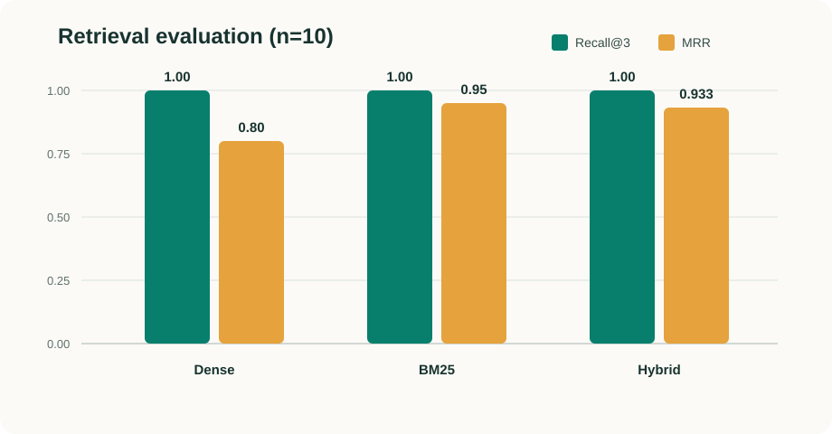
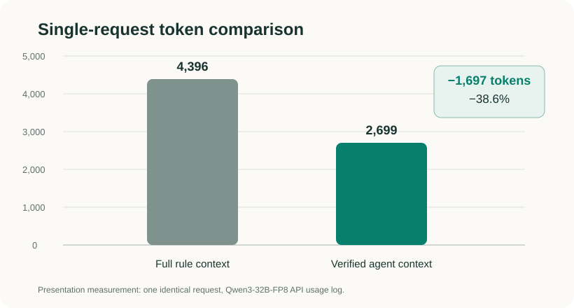

# Evaluation and Presentation Measurements

## Scope and Provenance

This page preserves every quantitative result reported in the team's August 7, 2026 presentation and accompanying script. The retrieval and decision results use 10 curated questions, while the token comparison uses one identical request against the Furiosa-hosted `furiosa-ai/Qwen3-32B-FP8` model. These are prototype measurements, not a production benchmark or a claim about the current default model configuration.

## Retrieval Quality

| Retriever | Recall@3 | MRR |
| --- | ---: | ---: |
| Dense | 1.00 | 0.80 |
| BM25 | 1.00 | 0.95 |
| Hybrid RRF | 1.00 | 0.933 (0.93 on the slide) |

- **Recall@3** measures whether a relevant rule appears among the first three results.
- **MRR** rewards placing the first relevant rule closer to rank one.
- All methods found a relevant rule within the top three for all 10 questions.
- BM25 ranked the first relevant result highest on this set. Hybrid retrieval did not outperform BM25 here; its purpose is to combine semantic matching with exact numeric, unit, and identifier matching.

## Decision and Guardrail Results

| Check | Reported result | What was checked |
| --- | ---: | --- |
| Carry-on and checked-baggage decision match | 100% | Both displayed transport statuses matched the expected results for all 10 questions |
| Status and source guardrails | 10/10 passed | Generated statuses matched deterministic results and cited source IDs belonged to the retrieved evidence |

The presentation separated retrieval quality from final decision correctness. This distinction matters because finding the right rule does not by itself prove that arithmetic, thresholds, or generated explanations were applied correctly.

## Token Comparison

| Measurement | Full-rule context | Agent Loop | Difference |
| --- | ---: | ---: | ---: |
| Total tokens for one identical request | 4,396 | 2,699 | −1,697 (−38.6%) |
| Retrieval tool calls | Not reported | 1 `search_rules` call | — |
| Agent iterations | Not reported | 2 | Draft, then Harness validation |
| Validation outcome | Not reported | Verified | Status and source checks passed |

The comparison used an actual API usage log from the presentation implementation. Its value is evidence that selecting relevant rules before generation can reduce context cost; a single request is not enough to establish an average latency, cost, or token-saving rate.

## Recorded Web Demonstration

The presentation screenshot records a separate execution from the 2,699-token comparison above.

| Field | Recorded value |
| --- | --- |
| Route | Asiana Airlines, domestic, Japan to Japan, no transit country |
| Item | Two power banks, each `20,000mAh` at `3.7V` |
| Deterministic calculation | `20,000 × 3.7 ÷ 1000 = 74.0Wh` per battery |
| Overall status | Conditional |
| Carry-on | Conditional |
| Checked baggage | Prohibited |
| Explanation model | `furiosa-ai/Qwen3-32B-FP8` |
| Displayed usage | 2,557 tokens, 2 iterations |
| Applied sources | `ASIANA-POWER-BANK`, `JP-MLIT-POWER-BANK-2026` |
| Displayed verification date | August 5, 2026 |

The displayed reasons were that `74.0Wh` was within the capacity limit, two batteries were within the quantity limit, and power banks were prohibited in checked baggage. The conditions included terminal protection, direct carriage, no use or charging aboard the aircraft, no charging from cabin power, and keeping the batteries observable rather than in an overhead bin. Airline approval was shown for the `100–160Wh` band; unreadable capacity markings and additional China-departure requirements were shown as exceptions or cautions. The Japan notice was displayed as effective April 24, 2026, with a maximum of two power banks at or below `160Wh`, checked-baggage prohibition, and onboard storage and use restrictions.

The 2,557-token value belongs to this UI screenshot. The 2,699-token value belongs to the controlled full-context comparison, so the two values should not be treated as duplicate measurements of the same run.

## Limitations

- The evaluation contains only 10 curated questions and does not establish generalization to real passenger language.
- The raw question set, relevance judgments, and per-query rankings were not included in the provided presentation material, so the aggregate retrieval scores cannot yet be reproduced from this repository alone.
- The token result is a single-request comparison and may vary with model, prompt, retrieved evidence, and provider token accounting.
- Recall@3 saturation and lower Hybrid MRR than BM25 show that a larger, versioned evaluation set is necessary.
- These historical presentation results must not be read as measurements of the repository's current default Chat model.
