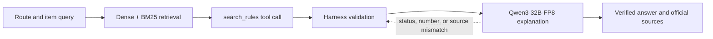

# CarryCheck Project Report

## Course and Team

- **Program:** Furiosa AI GPU/NPU-based LLM Agent and RAG Practice
- **Organizer:** Next-Generation Semiconductor Innovative Convergence University Project Group, Soongsil University
- **Schedule:** July 30–31 and August 7, 2026
- **Presentation:** August 7, 2026, Furiosa AI final presentation
- **Team:** Team 7
- **Presentation models:** `furiosa-ai/Qwen3-Embedding-8B` and `furiosa-ai/Qwen3-32B-FP8`

The short course covered LLM agents, retrieval-augmented generation, tool use, guardrails, retrieval evaluation, and inference efficiency. CarryCheck was built as the team's course project to demonstrate those concepts in an evidence-sensitive travel domain.

## Problem and Goal

Passengers normally have to inspect airline, departure-country, transit, and destination-country websites separately. Regulations change over time, and the answer depends on details such as carrier, route, capacity, quantity, packaging, and customs or quarantine requirements. Asking a generative model to decide directly can produce incorrect limits or merge legally distinct rules. CarryCheck therefore retrieves current evidence, calculates transport decisions deterministically, and uses an LLM only to explain a verified result.

The presentation used this representative request:

> On an Asiana international flight from the Republic of Korea to Japan, can I carry two 10,000 mL liquid containers?

The required inputs are the airline, origin, destination, optional transit country, route type, and a natural-language item description.

## Presentation Architecture

The presentation implementation treated the system as a verified Agent Loop. Qwen3-Embedding-8B supplied semantic retrieval, BM25 supplied exact matching, Reciprocal Rank Fusion combined both rankings, and `search_rules` exposed only relevant evidence to the agent. The Harness validated the tool call, computed states, numerical claims, and source IDs before an explanation was accepted. The design prevented the LLM from changing a deterministic baggage decision.

## Why Each Layer Exists

| Layer | Role | Technical reason |
| --- | --- | --- |
| Structured parsing | Extract item, route, `mL`, `mAh`, `V`, `Wh`, weight, and quantity | Policy thresholds cannot safely operate on ambiguous free text |
| Dense retrieval | Match semantic paraphrases such as “power bank” and “portable charger” | Equivalent items may use different vocabulary |
| BM25 retrieval | Match exact values and identifiers such as `100Wh`, `160Wh`, `100mL`, and `CCC` | Regulatory meaning often depends on exact strings |
| RRF | Fuse Dense and BM25 rank positions | The two retrievers produce scores on different scales |
| Rule engine | Calculate limits and set carry-on and checked statuses | Numerical and boundary decisions must not depend on generated prose |
| Country policy gates | Keep departure security, transit, customs, quarantine, and import checks distinct | Airline acceptance does not imply legal entry at the destination |
| Agent tool | Request only the evidence needed for the current item and route | Smaller context reduces irrelevant rules and token use |
| Harness | Validate status, numbers, tool use, and source IDs | A fluent explanation can still contradict the verified state |
| Generator | Turn the verified decision and evidence into readable guidance | Natural-language explanation is useful after the decision is fixed |

Retrieved rules were organized around six fields: airline, origin, destination, item, numerical values, and source ID.

## Decision and Failure Semantics

Battery capacity is calculated as `Wh = mAh × V ÷ 1000`. If voltage is missing, the system does not invent it; the result becomes `needs_information` where the missing value prevents a safe decision. The engine compares battery watt-hours, liquid container size, total capacity, quantity, packaging, and carrier approval bands. “Uncertain” therefore means that more information is required, not that an item is allowed.

The presentation Harness rejected status mismatches and unknown source IDs, retried when the agent did not call the retrieval tool, and described an API or validation fallback to the rule-based result. The current public implementation preserves the deterministic result but reports Chat failure explicitly in strict API mode, so an unverified template is not presented as model output.

## Demonstrated Case

The recorded web screen evaluated two `20,000mAh`, `3.7V` power banks on an Asiana domestic route within Japan. The engine calculated `74.0Wh` per battery and returned conditional carry-on, prohibited checked baggage, and an overall conditional status. Qwen3-32B-FP8 produced the explanation without changing those states, and the interface exposed reasons, conditions, exceptions, official rule IDs, verification date, model name, token use, and iteration count. The complete screenshot telemetry and Japan conditions are preserved in [Evaluation and Presentation Measurements](EVALUATION.md#recorded-web-demonstration).

## Results

| Area | Presentation result | Interpretation |
| --- | ---: | --- |
| Dense / BM25 / Hybrid Recall@3 | 1.00 / 1.00 / 1.00 | Every method found a relevant rule in the top three for all 10 questions |
| Dense / BM25 / Hybrid MRR | 0.80 / 0.95 / 0.933 | BM25 ranked first relevant evidence best on the small set |
| Carry-on and checked decision match | 100% | Both transport states matched all expected cases |
| Status and source guardrails | 10/10 passed | Generated envelopes preserved states and known sources |
| Full rules vs Agent Loop | 4,396 vs 2,699 tokens | 1,697 tokens, or 38.6%, were saved in one identical-request comparison |

See [Evaluation and Presentation Measurements](EVALUATION.md) for charts, exact values, experiment distinctions, and limitations.

## Presentation Snapshot and Current Repository

| Concern | August 2026 presentation | Current public repository |
| --- | --- | --- |
| Embedding model | `furiosa-ai/Qwen3-Embedding-8B` | Same API default; local profile uses character TF-IDF |
| Explanation model | `furiosa-ai/Qwen3-32B-FP8` | Configurable; `.env.example` currently selects `furiosa-ai/gpt-oss-120b` |
| Agent control | Model-selected `search_rules` tool in an Agent Loop | Application-controlled retrieval and compact context before generation |
| Validation | Harness checks tool use, statuses, numbers, and source IDs | Response guardrail checks statuses and source IDs; rule code remains authoritative |
| Failure behavior | Retry or substitute the rule-based answer | Preserve deterministic results and expose `ai_answer.status=error` in strict API mode |
| Measurements | Historical 10-question and single-request results | Not automatically reproduced by the current test suite |

This mapping keeps the public documentation auditable: presentation results are retained as historical evidence without implying that later implementation choices were part of the measured run.

## Lessons and Review Feedback

- Selective RAG can improve cost efficiency while retaining accuracy when only relevant evidence reaches the model.
- Efficiency decisions at retrieval and context assembly can improve the behavior of the entire service, not only one prompt.
- Adding post-generation validation creates another potential bottleneck; its latency and cost should be measured explicitly.
- Future agent evaluation could penalize incorrect tool calls, unnecessary backtracking, and expensive recovery paths.

These last two points came from the recorded course review and are design recommendations, not measured results of this repository.

## Roadmap

- Automate monitoring and updates for official China, Thailand, and Japan regulations.
- Evaluate `Qwen3-Reranker-8B` after hybrid retrieval.
- Publish a larger, versioned evaluation set based on real user questions, including accuracy, latency, and cost.
- Expand airline, country, transit, and item coverage.
- Measure Harness overhead and add trajectory metrics for tool-call errors and recovery.

## Presentation Coverage

| Slide | Subject | Public documentation |
| ---: | --- | --- |
| 1 | Project, team, and models | Course and Team |
| 2 | Problem and target experience | Problem and Goal |
| 3 | Verified Agent Loop | Presentation Architecture |
| 4 | Dense, BM25, and RRF | Why Each Layer Exists |
| 5 | Rule engine and Harness failures | Decision and Failure Semantics |
| 6 | Web demonstration | Demonstrated Case and evaluation telemetry |
| 7 | Retrieval and decision evaluation | Results and evaluation charts |
| 8 | Agent Loop token reduction | Results and token comparison |
| 9 | Lessons and next steps | Lessons, Review Feedback, and Roadmap |
