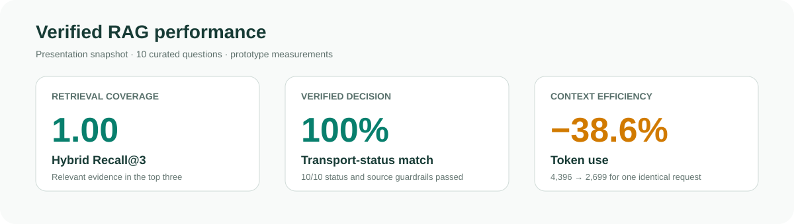

# CarryCheck Project Report

## Course

- **Program:** FuriosaAI GPU/NPU-Based RAG and LLM Agent Practice
- **Organizer:** Next-Generation Semiconductor Innovative Convergence University Project Group, Soongsil University
- **Schedule:** July 30–31 and August 7, 2026
- **Final presentation:** August 7, 2026
- **Team:** Team 7

The short course covered LLM agents, retrieval-augmented generation, tool use, guardrails, retrieval evaluation, and inference efficiency. CarryCheck was built as the course project to demonstrate those concepts in an evidence-sensitive travel domain.

## Problem and User Experience

Passengers normally have to inspect the operating airline, departure country, transit airport, and destination authorities separately. Regulations change, and the answer depends on capacity, quantity, packaging, route, customs, and quarantine conditions. CarryCheck accepts those trip details in one item description and returns separated carriage and entry results with conditions and official evidence.

The presentation used this representative request:

> On an Asiana international flight from the Republic of Korea to Japan, can I carry two 10,000 mL liquid containers?

## Models, Components, and Rationale

The system was designed as an evidence-first Agent Loop. Retrieval narrows the applicable rules, deterministic code calculates the statuses, and a generative model explains only the verified result. See the [README system summary](../README.md#system-at-a-glance) for the visual overview and [Architecture](ARCHITECTURE.md#component-chain) for the detailed execution diagram.

### Retrieve — `furiosa-ai/Qwen3-Embedding-8B` + BM25 + RRF

Qwen3-Embedding-8B was the actual Dense retrieval model used in the presentation and remains the API embedding default. It was selected to find semantically equivalent item descriptions that do not share the same words. BM25 runs beside it because regulatory queries depend on exact values such as `100Wh`, `160Wh`, `100mL`, and `CCC`; RRF combines both rank orders without score calibration.

**Observed result:** Dense, BM25, and Hybrid Recall@3 were all `1.00`. Their MRR values were `0.80`, `0.95`, and `0.933`, so the experiment supports complementary coverage but does not show a Hybrid MRR improvement over BM25.

### Decide — deterministic airline and country engines

No language model is allowed to calculate the final status. Python code evaluates `Wh = mAh × V ÷ 1000`, container size, total capacity, count, packaging, approval bands, and separate departure, transit, customs, quarantine, or import gates. Missing voltage or another safety-critical value produces `needs_information`, not an assumed permission.

**Observed result:** carry-on and checked-baggage outputs matched all 10 expected presentation cases.

### Explain — `furiosa-ai/Qwen3-32B-FP8`

Qwen3-32B-FP8 was the actual presentation model used for the Agent Loop, web demonstration, and token comparison. It was used as a Furiosa-hosted structured explanation model after evidence and statuses were fixed. The `search_rules` tool limited its context, and the Harness validated tool use, status values, numerical claims, and cited source IDs.

**Observed result:** one identical request fell from `4,396` to `2,699` tokens, saving `1,697` or `38.6%`; all `10/10` status and source guardrail cases passed. The improvement belongs to the retrieval-and-compaction design, not to an isolated model benchmark.

### Current Chat default — `furiosa-ai/gpt-oss-120b`

The current public repository uses gpt-oss-120b as the configurable `.env.example` default through an OpenAI API-compatible Chat endpoint. It performs the same constrained explanation role after application-controlled retrieval. No historical presentation metric is attributed to this later model choice.

## How the Composition Creates the Result

1. **Hybrid retrieval** prevents vocabulary differences from hiding evidence while preserving exact regulatory tokens.
2. **Deterministic ownership** makes numerical boundaries reproducible and prevents generated prose from changing legal states.
3. **Compact context** removes unrelated rules before generation, producing the measured token reduction.
4. **Post-generation validation** rejects state or source drift before the answer is displayed.

Retrieved rules were structured around airline, origin, destination, item, numerical values, and source ID. That structure let the Harness validate the answer against explicit fields rather than judging prose similarity.

## Demonstrated Case

The recorded screen evaluated two `20,000mAh`, `3.7V` power banks on an Asiana domestic route within Japan. The engine calculated `74.0Wh` per battery and returned conditional carry-on, prohibited checked baggage, and an overall conditional result. The interface exposed reasons, conditions, exceptions, official rule IDs, verification date, model name, token usage, and iteration count.

The screen recorded Qwen3-32B-FP8, `2,557` tokens, two iterations, and sources `ASIANA-POWER-BANK` and `JP-MLIT-POWER-BANK-2026`, verified August 5, 2026. See [Evaluation](EVALUATION.md#recorded-web-demonstration) for all conditions and the distinction from the separate 2,699-token comparison.

## Performance

The measurements show three prototype outcomes: relevant evidence appeared in the top three, deterministic decisions stayed aligned with expected statuses, and selected evidence reduced generation context. The 10-question set is too small for production or generalization claims; full values and limitations are preserved in [Evaluation](EVALUATION.md).

## Presentation and Current Repository

### August 2026 presentation snapshot

- Qwen3-Embedding-8B for Dense retrieval
- Qwen3-32B-FP8 for the Agent Loop and explanations
- Model-selected `search_rules` call followed by Harness validation
- Retry or rule-based substitution on missing tool calls, validation failure, or API error
- Historical 10-question evaluation and one-request token comparison

### Current public implementation

- Same API embedding default, plus character TF-IDF in the no-API local profile
- Configurable gpt-oss-120b Chat default
- Application-controlled retrieval and compact context before generation
- Explicit `ai_answer.status=error` in strict API mode while deterministic results remain available
- Historical presentation measurements documented without relabeling them as current-model results

The trust boundary remains unchanged: models assist retrieval and explanation, while deterministic code owns the decision.

## Lessons and Review Feedback

- Selective RAG can reduce context cost while retaining relevant evidence.
- Retrieval and context design can improve efficiency across the entire service, not only one prompt.
- Post-generation validation creates a new latency and cost bottleneck that should be measured.
- Future trajectory evaluation could penalize incorrect tool calls, unnecessary backtracking, and expensive recovery paths.

The last two items are recommendations from the recorded course review, not measured results of this repository.

## Roadmap

- Automate official-rule monitoring for China, Thailand, and Japan.
- Evaluate `Qwen3-Reranker-8B` after Hybrid retrieval; it is not used in the current system.
- Publish a larger, versioned evaluation set based on real user questions.
- Measure accuracy, latency, token cost, Harness overhead, and tool-recovery trajectories.
- Expand airline, country, transit, and item coverage.

<strong>Presentation coverage: slides 1–9</strong>

1. Project, course, team, and presentation models
2. Fragmented regulations and the target user experience
3. Verified Agent Loop architecture
4. Dense, BM25, and RRF retrieval
5. Deterministic decisions and Harness failures
6. Recorded web demonstration
7. Retrieval, decision, and guardrail evaluation
8. Agent Loop token reduction
9. Lessons, review feedback, and roadmap

